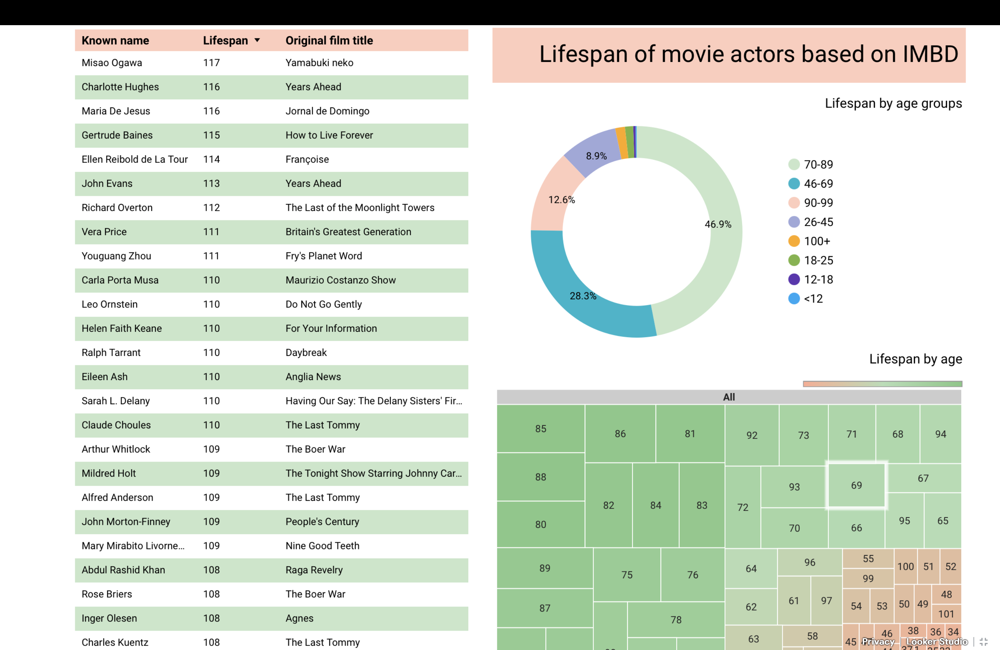
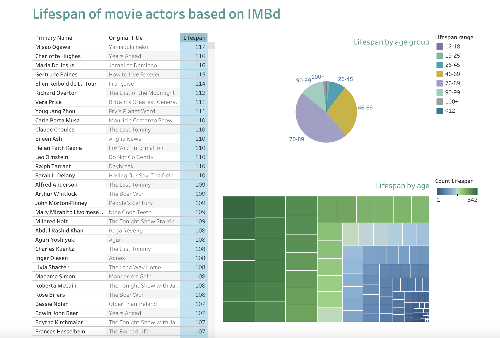
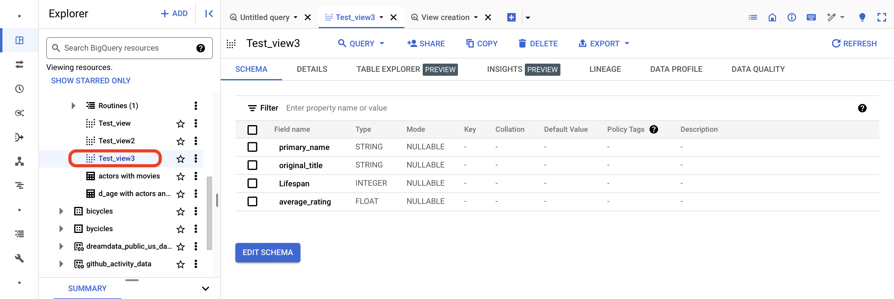
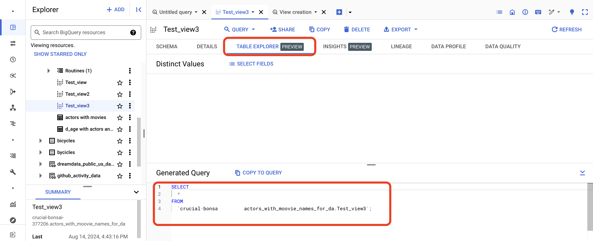

# data_analytics

1. I've tried simple integration of Looker with Google Cloud Big Query. For the data source I used public IMBd data shared via Analytics hub. 

Here’s an example of a Looker dashboard visualization that analyzes the lifespan of individuals mentioned on IMDb in relation to video materials listed on the same site. The interactive dashboard can be viewed [here](https://lookerstudio.google.com/embed/reporting/15deb2b7-387a-4cfd-9e1e-d1747ec0bafc/page/NFd8D) or by clicking on the image itself.

[](https://lookerstudio.google.com/embed/reporting/15deb2b7-387a-4cfd-9e1e-d1747ec0bafc/page/NFd8D)

Note: calculated field for Looker, D_age range:
```sql
CASE 
    WHEN [Lifespan] < 12 THEN '<12'
    WHEN [Lifespan] >= 12 AND [Lifespan] <= 18 THEN '12-18'
    WHEN [Lifespan] >= 19 AND [Lifespan] <= 25 THEN '19-25'
    WHEN [Lifespan] >= 26 AND [Lifespan] <= 45 THEN '26-45'
    WHEN [Lifespan] >= 46 AND [Lifespan] <= 69 THEN '46-69'
    WHEN [Lifespan] >= 70 AND [Lifespan] <= 89 THEN '70-89'
    WHEN [Lifespan] >= 90 AND [Lifespan] <= 99 THEN '90-99'
    ELSE '100+'
END
```


2. Did the same report for Tableau (with Google Cloud Big Query source).

The interactive dashboard can be viewed [here](https://public.tableau.com/app/profile/tanya.saburova/viz/BigQuery_IMBD/Dashboard1?publish=yes) or by clicking on the image itself.

[](https://public.tableau.com/app/profile/tanya.saburova/viz/BigQuery_IMBD/Dashboard1?publish=yes)

Note: calculated field for Tableau, d_age_range:
```
IF [Lifespan] < 12 THEN '<12'
  ELSEIF [Lifespan] >= 12 AND [Lifespan] <= 18 THEN '12-18'
  ELSEIF [Lifespan] >= 19 AND [Lifespan] <= 25 THEN '19-25'
  ELSEIF [Lifespan] >= 26 AND [Lifespan] <= 45 THEN '26-45'
  ELSEIF [Lifespan] >= 46 AND [Lifespan] <= 69 THEN '46-69'
  ELSEIF [Lifespan] >= 70 AND [Lifespan] <= 89 THEN '70-89'
  ELSEIF [Lifespan] >= 90 AND [Lifespan] <= 99 THEN '90-99'
  ELSE '100+'
END
```
___________________________________________________________
It has an icon different from a regular table, and once it's opened, it's needed to run an SQL query first before being able to see any data.




I've created a Test SQL View in BigQuery.  : 
```
CREATE VIEW actors_with_moovie_names_for_da.Test_view3 AS
SELECT
    name_basics.primary_name,
    title_basics.original_title,
    ( name_basics.death_year - name_basics.birth_year) AS Lifespan,
    title_ratings.average_rating
FROM
    imdb.name_basics
JOIN imdb.title_basics ON title_basics.tconst = name_basics.known_for_titles
JOIN imdb.title_ratings ON title_ratings.tconst = name_basics.known_for_titles

WHERE 
name_basics.death_year > 1000
AND 
name_basics.birth_year > 1000
GROUP BY
    Lifespan,
    name_basics.primary_name,
    title_basics.original_title,
    title_ratings.average_rating;
```

It has an icon different from a regular table, and once it's opened, it's needed to run an SQL query first before being able to see any data.


